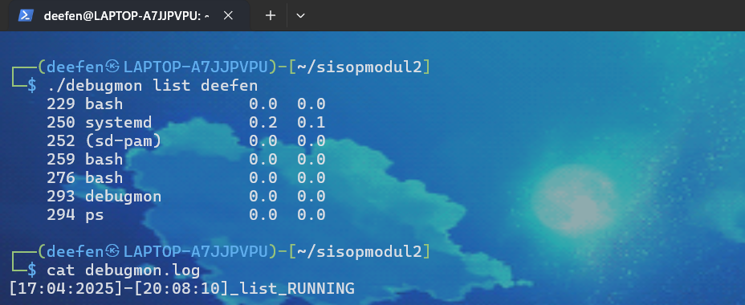
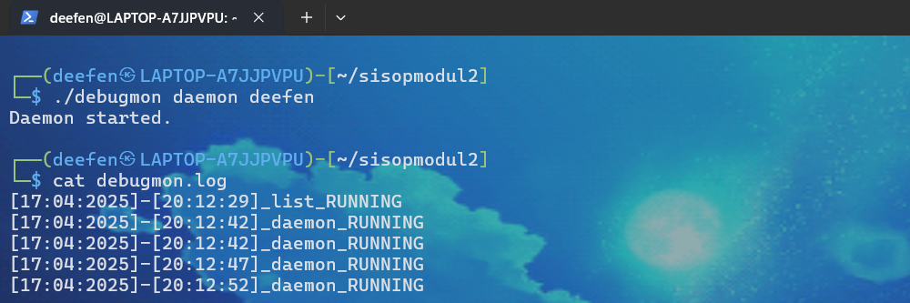
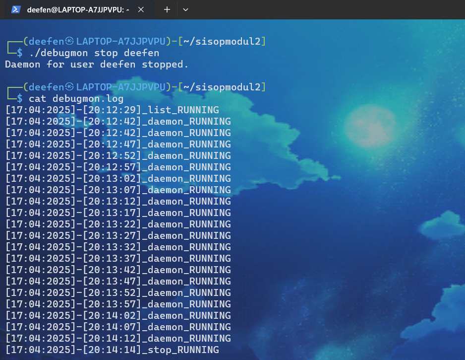
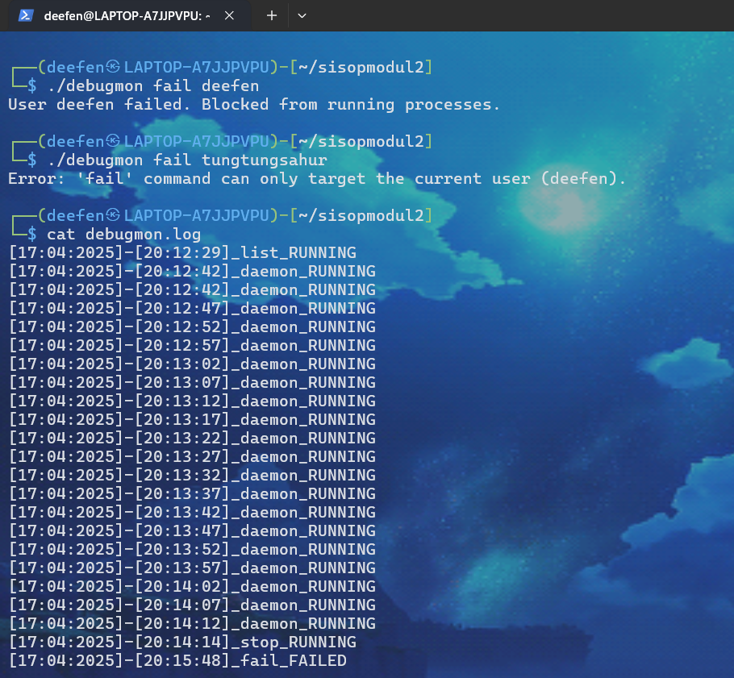
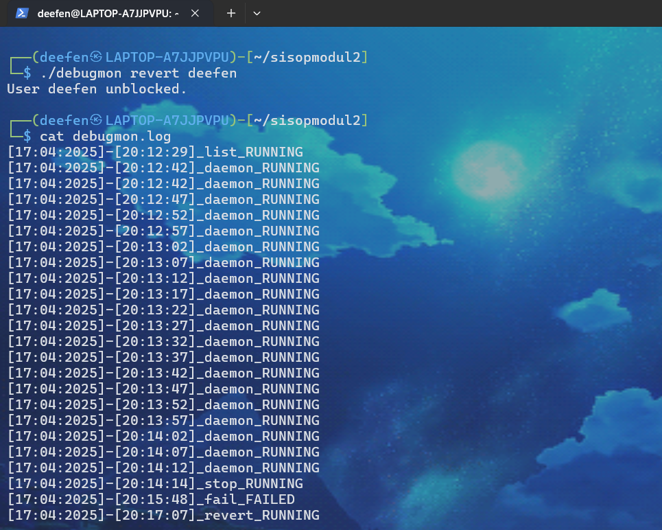
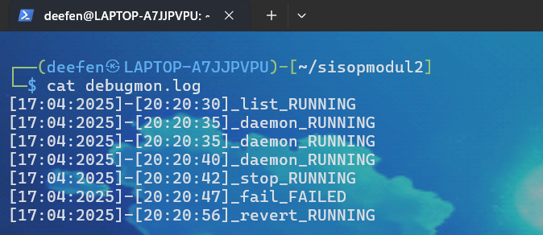

# Laporan Resmi Praktikum Sisop Modul 2


## Anggota Kelompok

| No | Nama                   | NRP         |
|----|------------------------|-------------|
| 1  | Aditya Reza Daffansyah | 5027241034  |
| 2  | Ahmad Yafi Ar Rizq     | 5027241066  |
| 3  | Zahra Khaalishah       | 5027241070  |


## Daftar Isi
### Soal 1
- [a. Downloading the Clues](#a-downloading-the-clues)
- [b. Filtering the Files](#b-filtering-the-files)
- [c. Combine the File Content](#c-combine-the-file-content)
- [d. Decode the file](#d-decode-the-file)
- [e. Password Check](#e-password-check)
  
### Soal 2
- [a. Download dan Unzip](#a-download-dan-unzip) 
- [b. Mendecrypt file pada direktori karantina](#b-mendecrypt-file-pada-direktori-karantina) 
- [c. Memindahkan file ke direktori karantina](#c-memindahkan-file-ke-direktori-karantina) 
- [d. Menghapus seluruh file pada direktori karantina](#d-menghapus-seluruh-file-pada-direktori-karantina)
- [e. Mematikan program decrypt dengan PID nya](#e-mematikan-program-decrypt-dengan-pid-nya)
- [f. Membuat error handling](#f-membuat-error-handling)
- [g. Mencatat log activity program](#g-mencatat-log-activity-program)
 
### Soal 3
- [a. Malware yang mengganti nama menjadi /init](#a-malware-yang-mengganti-nama-menjadi-init)
   
### Soal 4
- [a. Mengetahui semua aktivitas user](#a-mengetahui-semua-aktivitas-user)
- [b. Memasang mata mata dalam mode daemon](#b-memasang-mata-mata-dalam-mode-daemon)
- [c. Menghentikan pengawasan](#c-menghentikan-pengawasan)
- [d. Menggagalkan semua proses user yang sedang berjalan](#d-menggagalkan-semua-proses-user-yang-sedang-berjalan)
- [e. Mengizinkan user untuk kembali menjalankan proses](#e-mengizinkan-user-untuk-kembali-menjalankan-proses)
- [f. Mencatat ke dalam file log](#f-mencatat-ke-dalam-file-log)


# Soal 1
## a. Downloading the Clues
Pada soal ini diperintahkan untuk mendownload, unzip, dan kemudian menghapus Clues.zip

### Download
Untuk mendownload soal, saya menggunakan curl 
```
pid_t pid1 = fork();
    if (pid1 == 0) {
        char *curl_argv[] = {
            "/usr/bin/curl",
            "-L",
            "-o",
            "Clues.zip",
            "https://drive.usercontent.google.com/u/0/uc?id=1xFn1OBJUuSdnApDseEczKhtNzyGekauK&export=download",
            NULL
        };
        execve("/usr/bin/curl", curl_argv, NULL);
        perror("Gagal menjalankan curl");
        exit(1);
    }
    waitpid(pid1, &status, 0);
```
Disini `-L` berarti mengikuti link yang terdapat dibawahnya, kemudian `-o Clues.zip` berfungsi untuk menyimpan file yang di download bernama Clues.zip

Kemudian ```execve("/usr/bin/curl", curl_argv, NULL);``` digunakan untuk menjalankan program curl. ```perror("Gagal menjalankan curl");``` tidak akan jalan apabila code berhasil mendownload file dari link drive. 
`waitpid(pid1, &status, 0);` berfungsi untuk menunggu code tersebut selesai tereksekusi, setelah itu dilanjut pada code berikutnya.

### Unzip
```
    char *unzip_argv[] = {
            "/usr/bin/unzip",
            "-o",
            "Clues.zip",
            NULL
        };
        execve("/usr/bin/unzip", unzip_argv, NULL);
        perror("Gagal menjalankan unzip");
        exit(1);
```
Untuk soal ini saya menggunakan code `unzip` yang terletak di `usr/bin/unzip` pada linux. Hasil extrak akan disimpan pada folder dengan file Clues.zip. `execve("/usr/bin/unzip", unzip_argv, NULL);` execve ini digunakan untuk menjalankan code tersebut. `perror("Gagal menjalankan unzip");` akan berjalan ketika file gagal di ekstrak.

### Remove Clues.zip
```
    char *rm_argv[] = {
            "/usr/bin/rm",
            "-f",
            "Clues.zip",
            NULL
        };
        execve("/usr/bin/rm", rm_argv, NULL);
        perror("Gagal remove");
        exit(1);
```
Saya menggunakan perintah `rm` yang terletak di `/usr/bin/rm` untuk menghapus file Clues.zip setelah file tersebut berhasil diekstrak.

Argumen yang saya gunakan adalah `-f` (force) yang berfungsi untuk menghapus file secara paksa, kemudian `"Clues.zip"` adalah nama file yang ingin dihapus. `execve("/usr/bin/rm", rm_argv, NULL);` digunakan untuk menjalankan perintah rm.

## b. Filtering the Files
Pada soal ini diperintahkan untuk memindahkan file yang memiliki nama 1 huruf dan 1 angka kedalam folder Filtered.

```
int syarat(char *name) {
    int len = strlen(name);
    if (len != 5) return 0;
    if (strcmp(&name[1], ".txt") != 0) return 0;
    char c = name[0];
    if ((c >= 'a' && c <= 'z') || (c >= 'A' && c <= 'Z') || (c >= '0' && c <= '9')) return 1;
    return 0;
}
```
Pada function ini saya buat untuk memeriksa nama file apakah memenuhi syarat yaitu 1 huruf atau 1 angka kemudian setelahnya format file .txt.

Selanjutnya pada function filter ```void filter () {```

Code `mkdir("Filtered",0777);` berfungsi untuk membuat folder baru bernama "Filtered" dan `0777` berarti folder tersebut dapar di read, write, dan execute. Code `char *folders[] = {"Clues/ClueA", "Clues/ClueB", "Clues/ClueC", "Clues/ClueD"};` berfungsi untuk mengatur folder mana yang ingin diperiksa. Code `for (int i = 0; i < 4; i++) { DIR *dir = opendir(folders[i]); if (dir == NULL) continue;` berfungsi untuk melakukan looping ke setiap folder yang akan diperiksa, jika tidak bisa dibuka atau `NULL` maka akan lanjut ke folder berikutnya. 

```
struct dirent *entry;
        while ((entry = readdir(dir)) != NULL) {
            if (entry->d_name[0] != '.')
```
Code ini berfungsi untuk membaca semua isi pada folder, kemudian diperiksa `d_name[0] != '.'` untuk memeriksa juga file tersembunyi.

```
if (syarat(entry->d_name)) {
	char from[100], to[100];
        sprintf(from, "%s/%s", folders[i], entry->d_name);
        sprintf(to, "Filtered/%s", entry->d_name);
        rename(from, to);
```
Code ini membuat file yang memennuhi syarat fipindah kedalam folder "Filtered" dengan menggunakan argumen `rename()`

```
else {
	char path[100];
        sprintf(path, "%s/%s", folders[i], entry->d_name);
        remove(path);
} closedir(dir);
```
Code ini membuat file yang tidak memenuhi syarat akan dihapus menggunakan `remove(path)`. Selanjutnya `closedir(dir)` berfungsi untuk menutup folder setelah semua berhasil dijalankan.

```
if (argc == 3 && strcmp(argv[1], "-m") == 0) {
        if (strcmp(argv[2], "Filter") == 0) {
            filter();
```
Code berikut digunakan untuk menjalankan program filter dengan `-m Filter`.

## c. Combine the File Content
Pada soal ini diperintahkan untuk menggabungkan isi file dengan urutan huruf lalu angka kemudian huruf dan seterusnya. Setelah itu file pada folder sebelumnya dihapus.

```
void combine() {
    char angka[100][20];
    char huruf_arr[100][20];
    int a = 0, h = 0;

    DIR *dir = opendir("Filtered");
    struct dirent *entry;

    while ((entry = readdir(dir)) != NULL) {
        if (entry->d_name[0] != '.' && txt(entry->d_name)) {
            if (nomer(entry->d_name[0])) {
                strcpy(angka[a++], entry->d_name);
            } else if (huruf(entry->d_name[0])) {
                strcpy(huruf_arr[h++], entry->d_name);
            }
        }
    }
    closedir(dir);
```
Code berikut berfungsi untuk membuka folder bernama "Filtered" kemudian menyimpan nama file dalam folder tersebut menggunakan `angka[]` dan `huruf_arr[]`.  Code `nomer` dan `huruf` berfungsi untuk memeriksa apakah file tersebut angka atau huruf.

```
int txt(char *name) {
    return strlen(name) == 5 && strcmp(&name[1], ".txt") == 0;
}
int nomer(char c) {
    return c >= '0' && c <= '9';
}
int huruf(char c) {
    return (c >= 'a' && c <= 'z') || (c >= 'A' && c <= 'Z');
}
```
Code tersebut adalah code lengkap untuk memeriksa apakah file tersebut angka atau huruf dan apakah format file .txt.

```
    sort(angka, a);
    sort(huruf_arr, h);
```
Code teresbut berfungsi untuk menenentukan untuk sort angka dilambangkan dengan a, dan huruf_arr dengan h.

```
    FILE *gabung = fopen("Combined.txt", "w");
    int i = 0, j = 0;
    while (i < a || j < h) {
```
Membuka file Combined.txt untuk ditulis. Loop dilakukan sampai semua file angka (a) dan huruf (h) selesai diproses.

```
        if (i < a) {
            char path[100];
            sprintf(path, "Filtered/%s", angka[i]);
            FILE *f = fopen(path, "r");
            if (f) {
                char ch;
                while ((ch = fgetc(f)) != EOF) {
                    fputc(ch, gabung);
                }
                fclose(f);
                remove(path);
            }
            i++;
        }
        if (j < h) {
            char path[100];
            sprintf(path, "Filtered/%s", huruf_arr[j]);
            FILE *f = fopen(path, "r");
            if (f) {
                char ch;
                while ((ch = fgetc(f)) != EOF) {
                    fputc(ch, gabung);
                }
                fclose(f);
                remove(path);
            }
            j++;
```
Membuka file angka dan huruf kemudian isi dari file tersebut di masukkan kedalam file Combined.txt setelah itu hapus file yang telah dipindahkan isinya dan dilanjutkan ke file berikutnya. 

```
if (argc == 3 && strcmp(argv[1], "-m") == 0) {
    ...
    else if (strcmp(argv[2], "Combine") == 0) {
        combine();
    }
}

```
Code berikut digunakan untuk menjalankan program filter dengan `-m Combine`.

## d. Decode the file
```
char rot13(char c) {
    if (c >= 'a' && c <= 'z') return ((c - 'a' + 13) % 26) + 'a';
    if (c >= 'A' && c <= 'Z') return ((c - 'A' + 13) % 26) + 'A';
    return c;
}
```
Code berikut berfungsi untuk mengubah isi dari Combined.txt dengan rot13 menjadi Password untuk masuk kedalam Lokasi dengan cara mengubah isi dari Combined.txt untuk setiap karakter ditambah 13 kemudian modulus 26 kemudian ditambah huruf awalnya.

```
void decode() {
    FILE *input = fopen("Combined.txt", "r");
    FILE *output = fopen("Decoded.txt", "w");
```
Code ini berfungsi untuk membuka file Combined.txt sebagai input, kemudian sebagai output dimasukkan dalam file Decoded.txt

```
if (input && output) {
        char ch;
        while ((ch = fgetc(input)) != EOF) {
            fputc(rot13(ch), output);
```
Code ini akan dijalankan setelah input dan output dibuka. Code akan membaca tiap karakter dari isi file Combined.txt kemudian mengubahnya dengan function rot13 dan dituliskan hasilnya kedalam Decoded.txt.

```
fclose(input);
fclose(output);
```
Menutup file input dan output.

```
if (argc == 3 && strcmp(argv[1], "-m") == 0) {
    ...
    else if (strcmp(argv[2], "Decode") == 0) {
        combine();
    }
}
```
Code berikut digunakan untuk menjalankan program filter dengan `-m Decode`.

## e. Password Check
Setelah mendapatkan hasil dari Decoded.txt, selanjutnya output dimasukkan kedalam Lokasi Password Check dan hasilnya sebagai berikut.


### Error Handling
### Download Error


Error disebabkan oleh code shell dalam file c.
Solution:
```
system("wget --no-check-certificate 'https://drive.usercontent.google.com/u/0/uc?id=1xFn1OBJUuSdnApDseEczKhtNzyGekauK&export=download' -O Clues.zip");
system("unzip Clues.zip");
system("rm Clues.zip");
```
Menambahkan `system` agar code bisa berjalan.

### Larangan System
Karena ada larangan menggunakan system, saya mengubah code yang sebelumnya menggunakan `system()` menjadi menggunakan `execve(curl)` `execve(unzip)` `execve(rm)`

## Revisi
### Download
Dengan menggunakan code if-else untuk memeriksa directory, file tidak akan terdownload kembali setiap dijalankan
```
DIR *cek = opendir("Clues");
    if (cek != NULL) {
        closedir(cek);
    } else {
```

### Unavailable Command
Dengan menggunakan if-else, ketika dijalankan command selain Filter, Combine, dan Decode maka akan muncul message "Command tidak tersedia"
```
else {
            printf("Command tidak tersedia\n");
        }
    } else if (argc > 1) {
        printf("Command tidak tersedia\n");
    }
```

# Soal 2

## 🧾 Deskripsi 

Program `starterkit` ini dibuat untuk membantu Kanade dan tim N25 dalam menangani komputer yang melambat karena virus. Fitur-fitur yang dibuat mencakup pengelolaan file karantina, proses dekripsi otomatis dengan daemon, dan pencatatan aktivitas program.

---

## 📁 Struktur Direktori

```
soal_2/
├── activity.log         # Log aktivitas program
├── quarantine/          # Direktori karantina
├── starter_kit/         # Direktori awal file yang di-unzip
├── starterkit           # File executable
└── starterkit.c         # Source code
```

## a. Download dan Unzip

**Command:**
```bash
wget <link_file_zip> -O starterkit.zip
unzip starterkit.zip -d starter_kit/
rm starterkit.zip
```

**Cara Kerja:**
Program mengunduh file zip dari internet, mengekstraknya ke direktori `starter_kit/`, dan menghapus file zip-nya agar tidak menumpuk. File yang diekstrak nantinya akan dipindahkan ke karantina.
- Pastikan `starter_kit/` sudah ada, atau script buat otomatis.
- Jika link mati atau tidak valid, `wget` akan gagal.

---

## b. Mendecrypt file pada direktori karantina

**Command:**
```bash
./starterkit --decrypt
```

**Cara Kerja:**
Program menjalankan proses daemon di background yang:
- Mengecek isi direktori `quarantine/` setiap 10 detik.
- Mendekripsi nama file yang sebelumnya terenkripsi (dalam Base64).
- Rename nama file hasil decoding.

**Log Aktivitas:**
```
[dd-mm-yyyy][HH:MM:SS] - Successfully started decryption process with PID <pid>.
```

**Kendala:**
- Pastikan `libssl-dev` terpasang saat kompilasi.
- File dengan nama bukan Base64 bisa gagal didecode, tapi program tetap lanjut.

---

## c. Memindahkan file ke direktori karantina

**Command:**
```bash
./starterkit --quarantine
```

**Cara Kerja:**
Program membaca semua file di `starter_kit/`, lalu memindahkannya ke `quarantine/` menggunakan fungsi `rename()`. Nama file tidak diubah.

**Log Aktivitas:**
```
[dd-mm-yyyy][HH:MM:SS] - <nama file> - Successfully moved to quarantine directory.
```

**Kendala:**
- Direktori `starter_kit/` harus berisi file.
- Tidak ada file yang dipindah jika kosong.

---

## d. Menghapus seluruh file pada direktori karantina

**Command:**
```bash
./starterkit --eradicate
```

**Cara Kerja:**
Program menghapus seluruh file dalam `quarantine/` menggunakan fungsi `remove()`. Setiap penghapusan dicatat dalam log.

**Log Aktivitas:**
```
[dd-mm-yyyy][HH:MM:SS] - <nama file> - Successfully deleted.
```

**Kendala:**
- Tidak ada file yang dihapus jika direktori kosong.

---

## e. Mematikan program decrypt dengan PID nya

**Command:**
```bash
./starterkit --shutdown
```

**Cara Kerja:**
Program membaca file `.pid` yang menyimpan PID proses daemon, lalu mengirimkan sinyal `SIGTERM` untuk mematikan proses tersebut.

**Log Aktivitas:**
```
[dd-mm-yyyy][HH:MM:SS] - Successfully shut off decryption process with PID <pid>.
```

**Kendala:**
- File `.pid` tidak ditemukan jika daemon belum pernah dijalankan.
- Jika proses dengan PID tersebut tidak aktif, akan gagal menghentikan.

---

## f. Membuat error handling

**Command Salah:**
```bash
./starterkit --salah
```

**Output:**
```
Invalid option: --salah
```

**Cara Kerja:**
Program memvalidasi argumen. Jika tidak cocok dengan kelima opsi, akan invalid

---

## g. Mencatat log activity program

Semua aktivitas dicatat ke dalam file `activity.log` dalam format:

```
[dd-mm-yyyy][HH:MM:SS] - <deskripsi aktivitas>
```

log:
```
[18-04-2025][14:33:20] - fileA.txt - Successfully moved to quarantine directory.
[18-04-2025][14:33:30] - Successfully shut off decryption process with PID 12345.
```

---

## 💻 Source Code 

```
// Import library yang dibutuhkan
#include <stdio.h>
#include <stdlib.h>
#include <string.h>
#include <sys/stat.h>     // Untuk cek dan buat direktori
#include <sys/types.h>
#include <time.h>         // Untuk timestamp log
#include <unistd.h>       // Untuk fork(), sleep(), daemon
#include <dirent.h>       // Untuk membaca isi direktori
#include <errno.h>
#include <signal.h>       // Untuk mematikan proses daemon

#define STARTER_KIT "starter_kit"
#define QUARANTINE "quarantine"
#define LOG_FILE "activity.log"
#define PID_FILE ".pid"

// Deklarasi fungsi
void create_directory_if_not_exists(const char *dir_name);
void create_log_if_not_exists();
void write_log(const char *message);
void quarantine_files();
void return_files();
void eradicate_files();
void decrypt_daemon();
void shutdown_daemon();
char* base64_decode(const char* input);

// Fungsi untuk membuat direktori jika belum ada
void create_directory_if_not_exists(const char *dir_name) {
    struct stat st = {0};
    if (stat(dir_name, &st) == -1) {
        mkdir(dir_name, 0755);
    }
}

// Membuat file log jika belum ada
void create_log_if_not_exists() {
    FILE *f = fopen(LOG_FILE, "a");
    if (f == NULL) {
        perror("Could not create log file");
        exit(EXIT_FAILURE);
    }
    fclose(f);
}

// Menulis pesan ke dalam log file dengan format waktu
void write_log(const char *message) {
    FILE *f = fopen(LOG_FILE, "a");
    if (f == NULL) {
        perror("Could not write to log file");
        return;
    }

    time_t rawtime;
    struct tm *timeinfo;
    char buffer[80];

    time(&rawtime);
    timeinfo = localtime(&rawtime);

    strftime(buffer, sizeof(buffer), "[%d-%m-%Y][%H:%M:%S]", timeinfo);
    fprintf(f, "%s - %s\n", buffer, message);
    fclose(f);
}

// Memindahkan semua file dari starter_kit ke quarantine
void quarantine_files() {
    DIR *d = opendir(STARTER_KIT);
    if (!d) {
        perror("Could not open starter_kit directory");
        return;
    }

    struct dirent *dir;
    while ((dir = readdir(d)) != NULL) {
        if (strcmp(dir->d_name, ".") == 0 || strcmp(dir->d_name, "..") == 0) continue;

        char src_path[512], dest_path[512];
        snprintf(src_path, sizeof(src_path), "%s/%s", STARTER_KIT, dir->d_name);
        snprintf(dest_path, sizeof(dest_path), "%s/%s", QUARANTINE, dir->d_name);

        if (rename(src_path, dest_path) == 0) {
            char log_msg[600];
            snprintf(log_msg, sizeof(log_msg), "%s - Successfully moved to quarantine directory.", dir->d_name);
            write_log(log_msg);
        }
    }

    closedir(d);
}

// Mengembalikan file dari quarantine ke starter_kit
void return_files() {
    DIR *d = opendir(QUARANTINE);
    if (!d) {
        perror("Could not open quarantine directory");
        return;
    }

    struct dirent *dir;
    while ((dir = readdir(d)) != NULL) {
        if (strcmp(dir->d_name, ".") == 0 || strcmp(dir->d_name, "..") == 0) continue;

        char src_path[512], dest_path[512];
        snprintf(src_path, sizeof(src_path), "%s/%s", QUARANTINE, dir->d_name);
        snprintf(dest_path, sizeof(dest_path), "%s/%s", STARTER_KIT, dir->d_name);

        if (rename(src_path, dest_path) == 0) {
            char log_msg[600];
            snprintf(log_msg, sizeof(log_msg), "%s - Successfully returned to starter kit directory.", dir->d_name);
            write_log(log_msg);
        }
    }

    closedir(d);
}

// Menghapus semua file dalam direktori quarantine
void eradicate_files() {
    DIR *d = opendir(QUARANTINE);
    if (!d) {
        perror("Could not open quarantine directory");
        return;
    }

    struct dirent *dir;
    while ((dir = readdir(d)) != NULL) {
        if (strcmp(dir->d_name, ".") == 0 || strcmp(dir->d_name, "..") == 0) continue;

        char filepath[512];
        snprintf(filepath, sizeof(filepath), "%s/%s", QUARANTINE, dir->d_name);

        if (remove(filepath) == 0) {
            char log_msg[600];
            snprintf(log_msg, sizeof(log_msg), "%s - Successfully deleted.", dir->d_name);
            write_log(log_msg);
        }
    }

    closedir(d);
}

// Daemon: mendecode nama file terenkripsi Base64 di folder quarantine
void decrypt_daemon() {
    pid_t pid = fork();
    if (pid < 0) {
        perror("Failed to fork");
        exit(EXIT_FAILURE);
    }

    if (pid > 0) {
        printf("Daemon started with PID %d\n", pid);
        FILE *pf = fopen(PID_FILE, "w");
        if (pf) {
            fprintf(pf, "%d\n", pid);
            fclose(pf);
        }

        char msg[128];
        snprintf(msg, sizeof(msg), "Successfully started decryption process with PID %d.", pid);
        write_log(msg);
        exit(0);
    }

    setsid(); 
    chdir("/");
    fclose(stdin);
    fclose(stdout);
    fclose(stderr);

    while (1) {
        DIR *d = opendir(QUARANTINE);
        if (d) {
            struct dirent *dir;
            while ((dir = readdir(d)) != NULL) {
                if (strcmp(dir->d_name, ".") == 0 || strcmp(dir->d_name, "..") == 0) continue;

                char old_path[512], new_path[512];
                snprintf(old_path, sizeof(old_path), "%s/%s", QUARANTINE, dir->d_name);
                char *decoded = base64_decode(dir->d_name);
                snprintf(new_path, sizeof(new_path), "%s/%s", QUARANTINE, decoded);

                rename(old_path, new_path);
                free(decoded);
            }
            closedir(d);
        }

        sleep(10); // scan tiap 10 detik
    }
}

// Mematikan daemon decrypt dengan membaca PID dari file dan mengirim SIGTERM
void shutdown_daemon() {
    FILE *f = fopen(PID_FILE, "r");
    if (!f) {
        printf("No PID file found.\n");
        return;
    }

    int pid;
    fscanf(f, "%d", &pid);
    fclose(f);

    if (kill(pid, SIGTERM) == 0) {
        char msg[128];
        snprintf(msg, sizeof(msg), "Successfully shut off decryption process with PID %d.", pid);
        write_log(msg);
        remove(PID_FILE);
    } else {
        perror("Failed to shut down process");
    }
}

// Fungsi decode Base64 (menggunakan OpenSSL BIO)
char* base64_decode(const char* input) {
    BIO *bio, *b64;
    int len = strlen(input);
    char *buffer = (char*)malloc(len);
    memset(buffer, 0, len);

    b64 = BIO_new(BIO_f_base64());
    bio = BIO_new_mem_buf((void*)input, len);
    bio = BIO_push(b64, bio);
    BIO_set_flags(bio, BIO_FLAGS_BASE64_NO_NL);
    int decoded_size = BIO_read(bio, buffer, len);
    buffer[decoded_size] = '\0';
    BIO_free_all(bio);
    return buffer;
}

// Fungsi utama program
int main(int argc, char *argv[]) {
    create_directory_if_not_exists(STARTER_KIT);
    create_directory_if_not_exists(QUARANTINE);
    create_log_if_not_exists();

    if (argc != 2) {
        printf("Usage:\n");
        printf("  ./starterkit --decrypt\n");
        printf("  ./starterkit --quarantine\n");
        printf("  ./starterkit --return\n");
        printf("  ./starterkit --eradicate\n");
        printf("  ./starterkit --shutdown\n");
        return 1;
    }

    if (strcmp(argv[1], "--quarantine") == 0) {
        quarantine_files();
    } else if (strcmp(argv[1], "--return") == 0) {
        return_files();
    } else if (strcmp(argv[1], "--eradicate") == 0) {
        eradicate_files();
    } else if (strcmp(argv[1], "--decrypt") == 0) {
        decrypt_daemon();
    } else if (strcmp(argv[1], "--shutdown") == 0) {
        shutdown_daemon();
    } else {
        printf("Invalid option: %s\n", argv[1]);
        return 1;
    }

    return 0;
}


```

# Soal 3
## a. Malware yang mengganti nama menjadi /init

### Revisi :
```
#define _GNU_SOURCE
#include <stdio.h>
#include <stdlib.h>
#include <unistd.h>
#include <string.h>
#include <sys/prctl.h>

// Fungsi buat jadi daemon
void jadi_daemon() {
    pid_t pid = fork(); // Membuat proses baru

    if (pid < 0) exit(EXIT_FAILURE); // Gagal fork
    if (pid > 0) exit(EXIT_SUCCESS); // Keluar dari parent

    // Jadi session leader
    setsid();

    // Fork lagi biar nggak dapet terminal
    pid = fork();
    if (pid < 0) exit(EXIT_FAILURE);
    if (pid > 0) exit(EXIT_SUCCESS);

    // Ganti direktori kerja ke /
    chdir("/");

    // Tutup input/output terminal
    close(STDIN_FILENO);
    close(STDOUT_FILENO);
    close(STDERR_FILENO);
}

int main(int argc, char *argv[]) {
    jadi_daemon(); // Jalanin fungsi daemon

    // Ganti nama proses di sistem (misalnya terlihat /init)
    prctl(PR_SET_NAME, "/init", 0, 0, 0);

    // Ganti juga argv[0], supaya kalau orang lihat ps/top, namanya juga /init
    char *nama_asli = argv[0];
    int panjang = 0;
    for (int i = 0; i < argc; i++) {
        panjang += strlen(argv[i]) + 1;
    }

    memset(nama_asli, 0, panjang);           // Hapus nama asli
    strncpy(nama_asli, "/init", panjang - 1); // Tulis nama palsu

    // Proses tetap hidup selamanya
    while (1) {
        sleep(60); // Tidur tiap 1 menit
    }

    return 0;
}
```
`void jadi_daemon()` 
Membuat code berjalan secara deamon.

```pid_t pid = fork();```
Proses pertama menggunakan `fork()` untuk membuat proses baru. Jika `fork()` gagal, maka proses dihentikan dengan `exit(EXIT_FAILURE)`.

`chdir("/");` Berfungsi untuk mengubah direktori ke '/'

```
close(STDIN_FILENO);
close(STDOUT_FILENO);
close(STDERR_FILENO);
```
Code berikut membuat setelah menjadi daemon, stdin, stdout, dan stderr ditutup. Ini untuk memastikan bahwa proses tidak lagi terhubung dengan terminal atau file yang tidak diinginkan.

```prctl(PR_SET_NAME, "/init", 0, 0, 0);```
```
char *nama_asli = argv[0];
int panjang = 0;
for (int i = 0; i < argc; i++) {
    panjang += strlen(argv[i]) + 1;
}
memset(nama_asli, 0, panjang);
strncpy(nama_asli, "/init", panjang - 1);
```
Dengan code ini code akan berjalan dan saat ps aux akan terlihat dengan nama '/init'.

`while (1) {
    sleep(60);
}
` 
Code ini akan membuat process tetap berjalan terus-menerus. 

# Soal 4 
Suatu hari, Nobita menemukan sebuah alat aneh di laci mejanya. Alat ini berbentuk robot kecil dengan mata besar yang selalu berkedip-kedip. Doraemon berkata, "Ini adalah Debugmon! Robot super kepo yang bisa memantau semua aktivitas di komputer!" Namun, alat ini harus digunakan dengan hati-hati. Jika dipakai sembarangan, bisa-bisa komputer Nobita malah error total! 

## a. Mengetahui semua aktivitas user
Doraemon ingin melihat apa saja yang sedang dijalankan user di komputernya. Maka, dia mengetik:
`./debugmon list <user>`
. Debugmon langsung menampilkan daftar semua proses yang sedang berjalan pada user tersebut beserta PID, command, CPU usage, dan memory usage.

```
else if (strcmp(argv[1], "list") == 0) {
    pid_t pid = fork();
    if (pid == 0) {
        char *args[] = {
            "ps", "-u", argv[2],
            "-o", "pid,comm,%cpu,%mem",
            "--no-headers", NULL
        };
        execvp("ps", args);
        perror("Failed to exec ps");
        exit(1);
    } else if (pid < 0) {
        perror("Failed to fork for ps");
    }
    wait(NULL);
    write_custom_log("list", "RUNNING");
}
```

- Fungsi ini digunakan untuk menampilkan semua proses yang sedang berjalan oleh user tertentu.
- Menggunakan perintah `ps` dengan opsi khusus untuk menampilkan PID, command, CPU usage, dan memory usage.
- Menuliskan log program list dengan status `RUNNING`.
- Memanfaatkan `fork()` dan `execvp()` untuk menjalankan `ps`.

Output :




## b. Memasang mata-mata dalam mode daemon
Doraemon ingin agar Debugmon terus memantau user secara otomatis. Doraemon pun menjalankan program ini secara daemon dan melakukan pencatatan ke dalam file log dengan menjalankan:
`./debugmon daemon <user>`

```
else if (strcmp(argv[1], "daemon") == 0) {
    char pidfile[64];
    snprintf(pidfile, sizeof(pidfile), "debugmon_%s.pid", argv[2]);
    FILE *pf_check = fopen(pidfile, "r");
    if (pf_check) {
        int existing_pid;
        if (fscanf(pf_check, "%d", &existing_pid) == 1) {
            if (kill(existing_pid, 0) == 0) {
                printf("Daemon for user %s is already running with PID %d.\n", argv[2], existing_pid);
                fclose(pf_check);
                return 1;
            }
        }
        fclose(pf_check);
        remove(pidfile);
    }

    pid_t pid = fork();
    if (pid > 0) {
        printf("Daemon started.\n");
        exit(0);
    }
    if (pid < 0) {
        perror("Failed to fork for daemon");
        exit(1);
    }

    setsid();

    FILE *pf = fopen(pidfile, "w");
    if (pf) {
        fprintf(pf, "%d", getpid());
        fclose(pf);
    } else {
        perror("Failed to write PID file");
    }

    write_custom_log("daemon", "RUNNING");
    write_log(argv[2]);
}

void write_log(const char *user) {
    while (1) {
        char failfile[64];
        snprintf(failfile, sizeof(failfile), "fail_%s.flag", user);
        if (access(failfile, F_OK) == 0) {
            write_custom_log("daemon", "FAILED");
        } else {
            write_custom_log("daemon", "RUNNING");
        }
        sleep(5);
    }
}
```

- Membuat proses daemon yang berjalan di background untuk memantau user.
- Mengecek apakah daemon sudah berjalan dengan melihat file PID.
- Menggunakan `fork()` dan `setsid()` untuk membuat proses daemon.
- Menyimpan PID daemon ke file untuk referensi.
- Menjalankan fungsi `write_log()` yang terus menulis status ke log file setiap 5 detik.
- Menuliskan log program list dengan status `RUNNING`, kecuali dalam status fail, maka akan ditulis dengan status `FAILED`.

Output :




## c. Menghentikan pengawasan
User mulai panik karena setiap gerak-geriknya diawasi! Dia pun memohon pada Doraemon untuk menghentikannya dengan:
`./debugmon stop <user>`

```
else if (strcmp(argv[1], "stop") == 0) {
    char pidfile[64];
    snprintf(pidfile, sizeof(pidfile), "debugmon_%s.pid", argv[2]);

    FILE *pf = fopen(pidfile, "r");
    if (!pf) {
        printf("No running daemon for user %s.\n", argv[2]);
        return 1;
    }

    int daemon_pid;
    if (fscanf(pf, "%d", &daemon_pid) != 1) {
        fclose(pf);
        printf("Failed to read daemon PID.\n");
        return 1;
    }
    fclose(pf);

    if (kill(daemon_pid, SIGTERM) == 0) {
        printf("Daemon for user %s stopped.\n", argv[2]);
        remove(pidfile);
        write_custom_log("stop", "RUNNING");
    } else {
        perror("Failed to stop daemon");
    }
}
```

- Menghentikan proses daemon yang sedang berjalan
- Membaca PID daemon dari file yang dibuat saat daemon dijalankan
- Mengirim sinyal SIGTERM untuk menghentikan daemon
- Menghapus file PID setelah daemon berhenti
- Mencatat operasi stop ke log dengan status `RUNNING`
  
Output :





## d. Menggagalkan semua proses user yang sedang berjalan
Doraemon yang iseng ingin mengerjai user dengan mengetik:
`./debugmon fail <user>`
. Debugmon langsung menggagalkan semua proses yang sedang berjalan dan menulis status proses ke dalam file log dengan status FAILED. Selain menggagalkan, user juga tidak bisa menjalankan proses lain dalam mode ini.

```
else if (strcmp(argv[1], "fail") == 0) {
    if (getuid() == 0) {
        printf("Error: 'fail' command is not allowed for root user.\n");
        return 1;
    }

    struct passwd *pw = getpwuid(getuid());
    if (!pw) {
        perror("Failed to get current user information");
        return 1;
    }
    if (strcmp(pw->pw_name, argv[2]) != 0) {
        printf("Error: 'fail' command can only target the current user (%s).\n", pw->pw_name);
        return 1;
    }

    pid_t current_pid = getpid();

    pid_t pid = fork();
    if (pid == 0) {
        FILE *ps = popen("ps -u $(whoami) -o pid --no-headers", "r");
        if (!ps) {
            perror("Failed to run ps in fail");
            exit(1);
        }

        char line[256];
        while (fgets(line, sizeof(line), ps)) {
            int pid_to_kill = atoi(line);
            if (pid_to_kill > 0 && pid_to_kill != current_pid) {
                kill(pid_to_kill, SIGTERM);
            }
        }
        pclose(ps);
        exit(0);
    } else if (pid < 0) {
        perror("Failed to fork for killing in fail");
    }
    wait(NULL);

    char failfile[64];
    snprintf(failfile, sizeof(failfile), "fail_%s.flag", argv[2]);
    FILE *ff = fopen(failfile, "w");
    if (ff) {
        fprintf(ff, "User %s is blocked.\n", argv[2]);
        fclose(ff);
    } else {
        perror("Failed to create fail flag file");
    }

    write_custom_log("fail", "FAILED");
    printf("User %s failed. Blocked from running processes.\n", argv[2]);

    run_fail_daemon(argv[2]);
}

void run_fail_daemon(const char *user) {
    pid_t pid = fork();
    if (pid > 0) return;
    if (pid < 0) {
        perror("Failed to fork in run_fail_daemon");
        exit(1);
    }

    setsid();

    char failfile[64];
    snprintf(failfile, sizeof(failfile), "fail_%s.flag", user);

    while (1) {
        if (access(failfile, F_OK) == 0) {
            pid_t kill_pid = fork();
            if (kill_pid == 0) {
                FILE *ps = popen("ps -u $(whoami) -o pid --no-headers", "r");
                if (!ps) {
                    perror("Failed to run ps in run_fail_daemon");
                    exit(1);
                }

                char line[256];
                while (fgets(line, sizeof(line), ps)) {
                    int pid_to_kill = atoi(line);
                    if (pid_to_kill <= 0) continue;

                    char proc_path[256];
                    snprintf(proc_path, sizeof(proc_path), "/proc/%d/comm", pid_to_kill);
                    FILE *comm_file = fopen(proc_path, "r");
                    if (!comm_file) continue;

                    char comm[256];
                    if (fgets(comm, sizeof(comm), comm_file)) {
                        comm[strcspn(comm, "\n")] = 0;
                        if (strcmp(comm, "debugmon") != 0) {
                            kill(pid_to_kill, SIGTERM);
                        }
                    }
                    fclose(comm_file);
                }
                pclose(ps);
                exit(0);
            } else if (kill_pid < 0) {
                perror("Failed to fork for killing in run_fail_daemon");
            }
            wait(NULL);
        }
        sleep(5);
    }
}
``` 

- Mengentikan semua proses yang sedang berjalan oleh user tertentu.
- Membuat file flag untuk menandai bahwa user dalam status `FAILED`.
- Mencatat ke log dengan status `FAILED`.
- Menjalankan daemon `run_fail_daemon` yang akan memantau dan menghentikan proses baru.
- Menghentikan proses selain dari proses `debugmon` yang dipantau setiap 5 detik.
- Menargetkan fail untuk proses dari user. (root tidak diizinkan untuk mengeksekusi fungsi `fail`).

Output :




## e. Mengizinkan user untuk kembali menjalankan proses
Karena kasihan, Shizuka meminta Doraemon untuk memperbaiki semuanya. Doraemon pun menjalankan:
`./debugmon revert <user>`
. Debugmon kembali ke mode normal dan bisa menjalankan proses lain seperti biasa.

```
else if (strcmp(argv[1], "revert") == 0) {
    char failfile[64];
    snprintf(failfile, sizeof(failfile), "fail_%s.flag", argv[2]);

    if (access(failfile, F_OK) == 0) {
        if (remove(failfile) != 0) {
            perror("Failed to remove fail flag file");
        } else {
            write_custom_log("revert", "RUNNING");
            printf("User %s unblocked.\n", argv[2]);
        }
    } else {
        printf("User %s is not blocked.\n", argv[2]);
    }
}
```

- Mengembalikan proses seperti semula (menghilangkan fungsi `fail`)
- Menghapus file flag yang dihasilkan fungsi `fail`.
- Kembali mencatat log aktivitas dengan status `RUNNING`
- Memberikan output dan error handling yang sesuai.

Output :





## f. Mencatat ke dalam file log
Sebagai dokumentasi untuk mengetahui apa saja yang debugmon lakukan di komputer user, debugmon melakukan pencatatan dan penyimpanan ke dalam file debugmon.log untuk semua proses yang dijalankan dengan format
[dd:mm:yyyy]-[hh:mm:ss]_nama-process_STATUS(RUNNING/FAILED)
Untuk poin b, c, dan e, status proses adalah RUNNING. Sedangkan untuk poin d, status proses adalah FAILED.

```
void write_custom_log(const char *procname, const char *status) {
    FILE *log = fopen("debugmon.log", "a");
    if (!log) {
        perror("Failed to open debugmon.log");
        return;
    }

    time_t t = time(NULL);
    struct tm tm = *localtime(&t);

    fprintf(log, "[%02d:%02d:%d]-[%02d:%02d:%02d]_%s_%s\n",
            tm.tm_mday, tm.tm_mon + 1, tm.tm_year + 1900,
            tm.tm_hour, tm.tm_min, tm.tm_sec,
            procname, status);

    fclose(log);
}
```

- Fungsi utilitas untuk mencatat log aktivitas program `debugmon`.
- Memastikan untuk mengikuti constraits dari soal yaitu format `[dd:mm:yyyy]-[hh:mm:ss]_processname_STATUS`
- Membuka file dalam mode append untuk menambah input baru.
- Menulis timestamp dan status proses yang dijalankan.
  
Output Log Activity :





